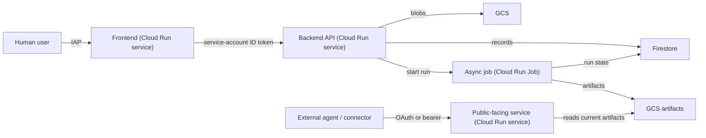

# GCP Cloud Run Architecture Scaffold

This is our house architecture for GCP-hosted products, distilled from a
production monorepo (multi-surface knowledge-graph service: an IAP-fronted
admin UI, a private API backend, an async ingestion job, and a
publicly-reachable MCP server). Apply the same shape to new projects
regardless of what the surfaces actually do.

Read this before writing any `Dockerfile`, GitHub Actions workflow, or
Terraform for a new GCP project — the default here is Cloud Build +
Buildpacks, not Docker or GitHub Actions.

## Core principles

- **No Dockerfiles.** Every deployable is a `Procfile` + a per-service
  dependency file (`requirements.txt`, `package.json`, etc.), built by Google
  Cloud Buildpacks (`pack build` or `gcloud run deploy --source`). See
  [No-Dockerfile technique](#the-no-dockerfile-technique-buildpacks--procfile).
- **One deployable, one build config, one minimal context.** Never build the
  whole monorepo in one shot. Each surface gets its own
  `deploy/cloudbuild.<surface>.yaml` that stages only the shared packages it
  actually imports into a scratch context under `/workspace/.deploy/<surface>`.
- **A dedicated build identity, never the Compute default SA.** One service
  account (e.g. `<prefix>-build`) runs every build across every surface.
  Runtime identity is a *separate* service account per surface
  (`<prefix>-frontend`, `<prefix>-api`, `<prefix>-worker`, ...). No service
  account JSON keys anywhere — not in source, images, or build artifacts.
- **GCS owns bytes, Firestore (or Cloud SQL) owns table state.** Large/immutable
  blobs (uploads, generated artifacts, exports) go in GCS. Structured
  records with a query pattern (job status, config rows, mappings) go in
  Firestore. Never store blobs in the table store; never treat bucket
  listings as the database.
- **Human auth is IAP, not application code.** Browser-facing surfaces sit
  behind Cloud Run IAP with `--no-allow-unauthenticated`; allowed users are
  managed in the IAP screen, not in app config or IAM bindings sprinkled
  through Terraform.
- **Service-to-service auth is OIDC identity tokens, not shared secrets.**
  A private caller mints an ID token from the metadata server with the
  callee's URL as audience and the callee trusts Cloud Run IAM
  (`roles/run.invoker`). A static bearer token is at most a defense-in-depth
  extra header for non-HTTPS/local paths — never the primary boundary for a
  production hop.
- **Publicly-reachable surfaces (external agents, webhooks, connectors) get
  their own auth mode**, switchable at deploy time (e.g. a `static` token for
  internal testing vs. an OAuth/OIDC-introspection mode for public traffic),
  and fail closed at startup if required settings for the selected mode are
  missing.
- **Artifacts are immutable and promoted, never mutated in place.** A batch
  job writes to `runs/{run_id}/...`, validates its own manifest, and only
  then flips a `current_version` pointer. Readers cache by version and
  reload on pointer change. Rollback = pointing at a prior validated run,
  never rewriting artifacts.
- **CI/CD is Cloud Build GitHub triggers scoped by path**, one trigger per
  surface, `--included-files` limited to that surface's tree plus the shared
  packages it depends on, branch-restricted to `main`. A push that only
  touches an unrelated surface must not rebuild everything.
- **Every build config sets `options.logging: CLOUD_LOGGING_ONLY`** and pins
  its build service account explicitly — required once you move off the
  legacy default Cloud Build SA, and it keeps logs consistent across every
  surface.

## System shape



Not every project needs all four surface types, but when a surface fits one
of these roles, build it this way:

| Surface role | Resource type | Auth boundary |
|---|---|---|
| Human-facing UI | Cloud Run service | IAP, `--no-allow-unauthenticated` |
| Internal API called by the UI | Cloud Run service | `--no-allow-unauthenticated` + caller's OIDC ID token, `roles/run.invoker` |
| Long-running / async / batch work | Cloud Run Job | invoked by the internal API via the Cloud Run Admin API, not public |
| Externally-reachable API (agents, webhooks, partners) | Cloud Run service | pluggable auth mode (static token for internal testing, OAuth/introspection for public) |

## The no-Dockerfile technique: Buildpacks + Procfile

Every deployable ships exactly two build-relevant files and no `Dockerfile`:

- A `Procfile` declaring the start command, e.g. `web: python3 main.py`.
- A dependency manifest for whatever language Buildpacks should detect
  (`requirements.txt` for Python, `package.json` for Node, ...).

For a pure-stdlib Python service that has no third-party dependencies, the
`requirements.txt` can be empty except for a comment — it still exists
*so Buildpacks detects the project as Python*:

```
# this service uses only the standard library.
# this file exists so Cloud Buildpacks detects the project as Python.
```

Buildpacks needs a Python version it still ships. If the region's Buildpacks
builder has dropped the interpreter version your `pyproject.toml` targets,
pin it explicitly by writing a `.python-version` file into the staged build
context at prepare time (don't commit one to source if local dev floats
across versions):

```bash
echo "3.13" > "$CONTEXT_DIR/.python-version"
```

Two deploy paths, depending on Cloud Run resource type:

- **Services**: `gcloud run deploy <name> --source=<context-dir> --build-service-account=<build-sa>` runs the Buildpacks build through a Cloud Run-managed inner Cloud Build. This is the default — no explicit image build step needed in the YAML.
- **Jobs**: `gcloud run jobs deploy` does **not** accept `--build-service-account`, so you can't source-deploy a job with a pinned build identity. Instead, run Buildpacks yourself as an explicit Cloud Build step (`gcr.io/k8s-skaffold/pack build ... --builder=gcr.io/buildpacks/builder --publish`) and then `gcloud run jobs deploy --image=...`. See [`reference/cloudbuild-job.yaml`](reference/cloudbuild-job.yaml).

Reach for a `Dockerfile` only when Buildpacks genuinely cannot express the
final layout (e.g. a non-Buildpacks-supported runtime, or native deps
Buildpacks can't compile) — treat that as the fallback, not the default.

### The frontend sub-technique: don't let Buildpacks build your JS

A browser SPA (React/Vite/etc.) served by a thin backend runtime is where
naive Buildpacks usage breaks down — the build context is mixed-language and
Buildpacks will not reliably detect and build both. Split it explicitly:

1. **Build the JS bundle in a plain Cloud Build step**, not through
   Buildpacks — e.g. `node:20` image running `npm ci && npm run build`.
2. **Copy the compiled output** (`dist/`) into the runtime service's
   `static/` directory.
3. **Deploy only the runtime directory** — a minimal server (Python stdlib
   `wsgiref`, or any thin framework) that serves `static/` and reverse-proxies
   `/api/*` to the real backend, attaching an OIDC ID token per request. This
   directory is all Buildpacks ever sees, so it detects trivially as a
   single-language, dependency-light service.
4. Cache aggressively for hashed asset filenames (`Cache-Control:
   public, max-age=31536000, immutable`), and `no-store` for the HTML shell
   and any unhashed file, so deploys take effect immediately without a
   cache-busting scheme.

This is the "no-buildpack-for-JS" move: Buildpacks only ever builds the
trivial static-file server; the actual frontend toolchain runs as an
explicit, fully-controlled Cloud Build step.

## CI/CD pipeline

One `deploy/cloudbuild.<surface>.yaml` per deployable. Each one:

1. **Prepares a minimal build context.** Copy just that surface's app
   directory plus the specific shared packages it imports into
   `/workspace/.deploy/<surface>/`. Never hand Buildpacks the whole monorepo.
2. **Auto-discovers upstream URLs it depends on**, rather than requiring an
   operator to plumb them through substitutions by hand. A step runs first,
   calls `gcloud run services describe <upstream> --format="value(status.url)"`,
   and writes the result to a `/workspace/.<name>_url` file the deploy step
   reads. Decide per-dependency whether a missing upstream should hard-fail
   the build (e.g. a frontend deploying without its backend would brick every
   request) or degrade gracefully (e.g. an optional integration that can come
   online later).
3. **Deploys with the pinned build/runtime service accounts** and
   `--update-env-vars`/`--update-secrets` (never `--set-env-vars`, which
   would wipe operator-set vars on every redeploy).
4. **Sets `options: { logging: CLOUD_LOGGING_ONLY }`.**

See [`reference/cloudbuild-service.yaml`](reference/cloudbuild-service.yaml)
and [`reference/cloudbuild-job.yaml`](reference/cloudbuild-job.yaml) for
full templates, and [`reference/create-triggers.sh`](reference/create-triggers.sh)
for the trigger-creation script.

GitHub triggers (one per surface, all branch-restricted to `^main$`):

```bash
gcloud builds triggers create github \
  --name="deploy-<surface>" \
  --region="${REGION}" \
  --repo-owner="${REPO_OWNER}" \
  --repo-name="${REPO_NAME}" \
  --branch-pattern="^main$" \
  --build-config="deploy/cloudbuild.<surface>.yaml" \
  --service-account="projects/${PROJECT_ID}/serviceAccounts/${BUILD_SA}" \
  --included-files="apps/<surface>/**,packages/<shared-deps>/**,deploy/cloudbuild.<surface>.yaml"
```

Before the first `gcloud builds triggers create github` call, the Cloud
Build GitHub App must be installed and authorized on the repo — that's a
one-time browser-only GitHub OAuth handshake with no `gcloud` equivalent.
Pick the Cloud Build trigger region deliberately (matches your data
residency requirement) before connecting the repo; 1st-gen connections are
regional and triggers can only reference repos connected in their own
region.

## Scaffolding checklist for a new project

1. Enable APIs: `run.googleapis.com cloudbuild.googleapis.com
   artifactregistry.googleapis.com iamcredentials.googleapis.com
   iap.googleapis.com storage.googleapis.com firestore.googleapis.com
   secretmanager.googleapis.com logging.googleapis.com monitoring.googleapis.com`
   (add `aiplatform.googleapis.com` if using Vertex AI).
2. Create GCS buckets for sources/artifacts (`uniform-bucket-level-access`)
   and a Firestore database, both in the target region.
3. Pre-create the Artifact Registry repo Buildpacks images land in
   (`cloud-run-source-deploy`, `docker` format) and the `gcloud run deploy
   --source` staging bucket (`gs://run-sources-${PROJECT_ID}-${REGION}`) so
   the build SA doesn't need project-level bucket-creation rights.
4. Create one build service account and one runtime service account per
   surface.
5. Grant the build SA: `roles/cloudbuild.builds.builder`,
   `roles/run.builder`, `roles/run.sourceDeveloper` (yes, this is required
   even when the bucket already exists — the `--source` preflight check
   runs before the bucket-existence check), `roles/run.admin`,
   `roles/artifactregistry.writer`, `roles/logging.logWriter`, and
   `roles/iam.serviceAccountUser` on every runtime SA it deploys as.
6. Grant each runtime SA only the resource access it needs (bucket-level
   `objectAdmin`/`objectViewer`, `roles/datastore.user` or `.viewer`, etc.)
   — least privilege per surface, not one shared broad role.
7. Write each surface's `Procfile` + dependency manifest, and a
   `deploy/cloudbuild.<surface>.yaml` from the templates in `reference/`.
8. Deploy internal-facing surfaces first, in dependency order, so
   auto-discovery has something to find; redeploy upstream-of-a-dependency
   surfaces once the thing they discover exists.
9. Enable IAP on any human-facing surface and add allowed users in the IAP
   screen — do not manage human access through IAM bindings.
10. Wire up service-to-service `roles/run.invoker` bindings for every
    caller → callee edge.
11. Connect the GitHub repo to Cloud Build (one-time, browser) and run
    `create-triggers.sh` for the four... or however many... surfaces.
12. Write down the promotion/rollback contract for anything that produces
    versioned artifacts before the first production run, not after.
