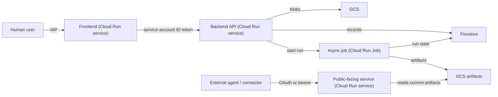

# GCP Cloud Run Architecture Scaffold

This is our house architecture for GCP-hosted products, distilled from a
production monorepo (multi-surface knowledge-graph service: an IAP-fronted
admin UI, a private API backend, an async ingestion job, and a
publicly-reachable MCP server). Apply the same shape to new projects
regardless of what the surfaces actually do.

Read this before writing any `Dockerfile`, GitHub Actions workflow, or
Terraform for a new GCP project — the default here is Cloud Build +
Buildpacks, not Docker or GitHub Actions.

## Core principles

- **First deploy is a recoverable state machine, not a linear happy path.**
  Scaffold bootstrap scripts and runbooks around checkpoints: credentials,
  state bucket, APIs, GitHub connection, base Terraform, secrets, service
  deploys, post-deploy IAM/IAP, and smoke tests. Reruns should converge
  without deleting durable resources.
- **No Dockerfiles.** Every deployable is a `Procfile` + a per-service
  dependency file (`requirements.txt`, `package.json`, etc.), built by Google
  Cloud Buildpacks (`pack build` or `gcloud run deploy --source`). See
  [No-Dockerfile technique](SKILL.md#the-no-dockerfile-technique-buildpacks--procfile)
- **One deployable, one build config, one minimal context.** Never build the
  whole monorepo in one shot. Each surface gets its own
  `deploy/cloudbuild.<surface>.yaml` that stages only the shared packages it
  actually imports into a scratch context under `/workspace/.deploy/<surface>`.
- **A dedicated build identity, never the Compute default SA.** One service
  account (e.g. `<prefix>-build`) runs every build across every surface.
  Runtime identity is a *separate* service account per surface
  (`<prefix>-frontend`, `<prefix>-api`, `<prefix>-worker`, ...). No service
  account JSON keys anywhere — not in source, images, or build artifacts.
- **GCS owns bytes, Firestore (or Cloud SQL) owns table state.** Large/immutable
  blobs (uploads, generated artifacts, exports) go in GCS. Structured
  records with a query pattern (job status, config rows, mappings) go in
  Firestore. Never store blobs in the table store; never treat bucket
  listings as the database.
- **Human auth is IAP, not application code.** Browser-facing surfaces sit
  behind Cloud Run IAP with `--no-allow-unauthenticated`; allowed users are
  managed in the IAP screen, not in app config or IAM bindings sprinkled
  through Terraform.
- **Service-to-service auth is OIDC identity tokens, not shared secrets.**
  A private caller mints an ID token from the metadata server with the
  callee's URL as audience and the callee trusts Cloud Run IAM
  (`roles/run.invoker`). A static bearer token is at most a defense-in-depth
  extra header for non-HTTPS/local paths — never the primary boundary for a
  production hop.
- **Publicly-reachable surfaces (external agents, webhooks, connectors) get
  their own auth mode**, switchable at deploy time (e.g. a `static` token for
  internal testing vs. an OAuth/OIDC-introspection mode for public traffic),
  and fail closed at startup if required settings for the selected mode are
  missing. If a surface must be reachable without Cloud Run IAM, make that an
  asserted deploy invariant (`--no-invoker-iam-check` or documented
  equivalent) and validate requests in the app.
- **Artifacts are immutable and promoted, never mutated in place.** A batch
  job writes to `runs/{run_id}/...`, validates its own manifest, and only
  then flips a `current_version` pointer. Readers cache by version and
  reload on pointer change. Rollback = pointing at a prior validated run,
  never rewriting artifacts.
- **CI/CD is Cloud Build v2 GitHub connections + path-scoped triggers**, one
  trigger per surface, `--included-files` limited to that surface's tree plus
  the shared packages it depends on, branch-restricted to `main`. Do not
  default to the older 1st-generation repository mapping flow.
- **Every build config pins its build service account and sets
  `options.logging: CLOUD_LOGGING_ONLY`** — required once you move off the
  legacy default Cloud Build SA, and it keeps logs consistent across every
  surface.
- **Cloud Build YAMLs must distinguish Cloud Build substitutions from shell
  variables.** User substitutions start with `_`; Bash variables inside YAML
  command strings are escaped as `$$VAR` or `$${VAR}`; custom substitution
  values must not rely on recursive expansion of `${PROJECT_ID}`.

## System shape



Not every project needs all four surface types, but when a surface fits one
of these roles, build it this way:

| Surface role | Resource type | Auth boundary |
|---|---|---|
| Human-facing UI | Cloud Run service | IAP, `--no-allow-unauthenticated` |
| Internal API called by the UI | Cloud Run service | `--no-allow-unauthenticated` + caller's OIDC ID token, `roles/run.invoker` |
| Long-running / async / batch work | Cloud Run Job | invoked by the internal API via the Cloud Run Admin API, not public |
| Externally-reachable API (agents, webhooks, partners) | Cloud Run service | pluggable auth mode (static token for internal testing, OAuth/introspection for public) |

## First-deploy operating contract

Before generating code or runbooks, define the deploy wrapper as these
recoverable phases:

1. Preflight local tools and credentials.
2. Ensure the Terraform state bucket exists; create it only if missing.
3. Enable required project APIs and create stable base infrastructure.
4. Ensure the Cloud Build v2 GitHub connection and linked repository, or
   explicitly defer triggers.
5. Run the first Terraform apply with Cloud Run service-specific IAM/IAP
   bindings disabled if the services do not exist yet.
6. Ensure required Secret Manager secret containers and enabled versions.
7. Deploy services/jobs in dependency order.
8. Run a second Terraform apply for IAM/IAP bindings that require deployed
   Cloud Run services.
9. Run smoke tests and print output URLs plus log-retrieval hints.

Credential stores are separate:

- `gcloud auth login`: operator credentials for direct `gcloud` commands.
- `gcloud auth application-default login`: local Application Default
  Credentials for Terraform backends and local Google client libraries.
- Cloud Run metadata credentials: deployed runtime service account identity.

Do not imply ADC is baked into images or used by deployed services. Preflight:

```bash
gcloud auth list --filter=status:ACTIVE --format='value(account)'
gcloud auth application-default print-access-token >/dev/null
gcloud auth application-default set-quota-project "$PROJECT_ID"
```

If Terraform or local clients fail with `invalid_grant` / `invalid_rapt`,
reauthenticate ADC; `set-quota-project` is not a reauth fix:

```bash
gcloud auth application-default login --project="$PROJECT_ID"
gcloud auth application-default set-quota-project "$PROJECT_ID"
```

Reruns are normal. Never ask the operator to delete a Terraform state bucket
after a failed apply. Check before creating state buckets, Cloud Build
connections, triggers, Secret Manager secret containers, service accounts, and
IAM bindings. Once stable, Terraform should converge with no resource changes.

Secret handling is explicit:

- First deploy creates required secret versions.
- Normal reruns verify that an enabled version exists.
- New versions require `ROTATE_SECRETS=1`, `ADD_SECRET_VERSION=1`, or another
  explicit operator intent.
- Keep real values out of shell history, chat, screenshots, and support logs.
  If a secret appears in any of those places, rotate it.

Prefer hidden input for ad hoc first setup:

```bash
read -r -s -p "Client secret: " CLIENT_SECRET
printf '\n'
export CLIENT_SECRET
```

## The no-Dockerfile technique: Buildpacks + Procfile

Every deployable ships exactly two build-relevant files and no `Dockerfile`:

- A `Procfile` declaring the start command, e.g. `web: python3 main.py`.
- A dependency manifest for whatever language Buildpacks should detect
  (`requirements.txt` for Python, `package.json` for Node, ...).

For a pure-stdlib Python service that has no third-party dependencies, the
`requirements.txt` can be empty except for a comment — it still exists
*so Buildpacks detects the project as Python*:

```
# this service uses only the standard library.
# this file exists so Cloud Buildpacks detects the project as Python.
```

Buildpacks needs a Python version it still ships. If the region's Buildpacks
builder has dropped the interpreter version your `pyproject.toml` targets,
pin it explicitly by writing a `.python-version` file into the staged build
context at prepare time (don't commit one to source if local dev floats
across versions):

```bash
echo "3.13" > "$CONTEXT_DIR/.python-version"
```

Two deploy paths, depending on Cloud Run resource type:

- **Services**: `gcloud run deploy <name> --source=<context-dir> --build-service-account=<build-sa>` runs the Buildpacks build through a Cloud Run-managed inner Cloud Build. This is the default — no explicit image build step needed in the YAML.
- **Jobs**: `gcloud run jobs deploy` does **not** accept `--build-service-account`, so you can't source-deploy a job with a pinned build identity. Instead, run Buildpacks yourself as an explicit Cloud Build step (`gcr.io/k8s-skaffold/pack build ... --builder=gcr.io/buildpacks/builder --publish`) and then `gcloud run jobs deploy --image=...`. See [`reference/cloudbuild-job.yaml`](reference/cloudbuild-job.yaml).

Reach for a `Dockerfile` only when Buildpacks genuinely cannot express the
final layout (e.g. a non-Buildpacks-supported runtime, or native deps
Buildpacks can't compile) — treat that as the fallback, not the default.

### The frontend sub-technique: don't let Buildpacks build your JS

A browser SPA (React/Vite/etc.) served by a thin backend runtime is where
naive Buildpacks usage breaks down — the build context is mixed-language and
Buildpacks will not reliably detect and build both. Split it explicitly:

1. **Build the JS bundle in a plain Cloud Build step**, not through
   Buildpacks — e.g. `node:20` image running `npm ci && npm run build`.
2. **Copy the compiled output** (`dist/`) into the runtime service's
   `static/` directory.
3. **Deploy only the runtime directory** — a minimal server (Python stdlib
   `wsgiref`, or any thin framework) that serves `static/` and reverse-proxies
   `/api/*` to the real backend, attaching an OIDC ID token per request. This
   directory is all Buildpacks ever sees, so it detects trivially as a
   single-language, dependency-light service.
4. Cache aggressively for hashed asset filenames (`Cache-Control:
   public, max-age=31536000, immutable`), and `no-store` for the HTML shell
   and any unhashed file, so deploys take effect immediately without a
   cache-busting scheme.

This is the "no-buildpack-for-JS" move: Buildpacks only ever builds the
trivial static-file server; the actual frontend toolchain runs as an
explicit, fully-controlled Cloud Build step.

### Staged context runtime rules

Minimal Buildpacks contexts are intentional, but they change runtime layout:
the service runs from a shallow `/workspace` app, not the source monorepo.
Cloud Run entrypoints must not depend on fixed-depth paths such as
`Path(__file__).resolve().parents[2]`.

Use parent discovery for local shared packages:

```python
import sys
from pathlib import Path


def _add_local_common_package_path() -> None:
    for parent in Path(__file__).resolve().parents:
        package_path = parent / "packages" / "python"
        if package_path.exists():
            sys.path.insert(0, str(package_path))
            return
```

Add a staged-layout import check for every Python surface:

```bash
python3 -m compileall apps/<surface>/main.py
tmp="$(mktemp -d)"
mkdir -p "$tmp/<surface>/packages"
cp -R apps/<surface>/. "$tmp/<surface>/"
cp -R packages/python/<shared_pkg> "$tmp/<surface>/packages/"
cd "$tmp/<surface>"
PYTHONPATH="$tmp/<surface>/packages:$tmp/<surface>" python3 -c 'import main'
```

## CI/CD pipeline

One `deploy/cloudbuild.<surface>.yaml` per deployable. Each one:

1. **Prepares a minimal build context.** Copy just that surface's app
   directory plus the specific shared packages it imports into
   `/workspace/.deploy/<surface>/`. Never hand Buildpacks the whole monorepo.
2. **Auto-discovers upstream URLs it depends on**, rather than requiring an
   operator to plumb them through substitutions by hand. A step runs first,
   calls `gcloud run services describe <upstream> --format="value(status.url)"`,
   and writes the result to a `/workspace/.<name>_url` file the deploy step
   reads. Decide per-dependency whether a missing upstream should hard-fail
   the build (e.g. a frontend deploying without its backend would brick every
   request) or degrade gracefully (e.g. an optional integration that can come
   online later).
3. **Deploys with the pinned build/runtime service accounts** and
   `--update-env-vars`/`--update-secrets` (never `--set-env-vars`, which
   would wipe operator-set vars on every redeploy).
4. **Pins the build identity in the YAML** with
   `serviceAccount: projects/${PROJECT_ID}/serviceAccounts/${_BUILD_SERVICE_ACCOUNT}@${PROJECT_ID}.iam.gserviceaccount.com`.
5. **Sets `options: { logging: CLOUD_LOGGING_ONLY }`.**

See [`reference/cloudbuild-service.yaml`](reference/cloudbuild-service.yaml)
and [`reference/cloudbuild-job.yaml`](reference/cloudbuild-job.yaml) for
full templates, and [`reference/create-triggers.sh`](reference/create-triggers.sh)
for the trigger-creation script.

Cloud Build YAML guardrails:

- User substitutions start with `_`: `${_REGION}`, `${_SERVICE_NAME}`,
  `${_BUILD_SERVICE_ACCOUNT}`.
- Bash variables that should survive into the container use `$$`: `$${URL}`,
  `$$FIRESTORE_DB`.
- Do not define custom substitutions like
  `_RUNTIME_SERVICE_ACCOUNT: service@${PROJECT_ID}.iam.gserviceaccount.com`;
  store account-name prefixes and construct the full email in command strings.
- Use `--update-env-vars` and `--update-secrets`, not `--set-*`, unless you
  intentionally replace every existing value.
- Use a custom substitution delimiter when values can contain commas:
  `--substitutions=^|^_KEY=value,with,commas|_OTHER=value`.

Static scans worth adding to generated repos:

```bash
rg -n '_BUILD_SERVICE_ACCOUNT: .*PROJECT_ID|_RUNTIME_SERVICE_ACCOUNT: .*PROJECT_ID' deploy/*.yaml
rg -n -P '(?<!\$)\$\{(FIRESTORE_DB|ASSET_BUCKET|API_URL)\}|(?<!\$)\$(FIRESTORE_DB|ASSET_BUCKET|API_URL)\b' deploy/*.yaml
```

GitHub triggers use Cloud Build v2 repositories (one trigger per surface, all
branch-restricted to `^main$`):

```bash
gcloud builds connections create github "${CONNECTION_NAME}" \
  --project="${PROJECT_ID}" \
  --region="${REGION}"

gcloud builds connections describe "${CONNECTION_NAME}" \
  --project="${PROJECT_ID}" \
  --region="${REGION}" \
  --format="value(installationState.stage)"

gcloud builds repositories create "${REPOSITORY_NAME}" \
  --project="${PROJECT_ID}" \
  --region="${REGION}" \
  --connection="${CONNECTION_NAME}" \
  --remote-uri="https://github.com/${REPO_OWNER}/${REPO_NAME}.git"

gcloud builds triggers create github \
  --name="deploy-<surface>" \
  --region="${REGION}" \
  --repository="projects/${PROJECT_ID}/locations/${REGION}/connections/${CONNECTION_NAME}/repositories/${REPOSITORY_NAME}" \
  --branch-pattern="^main$" \
  --build-config="deploy/cloudbuild.<surface>.yaml" \
  --service-account="projects/${PROJECT_ID}/serviceAccounts/${BUILD_SA_NAME}@${PROJECT_ID}.iam.gserviceaccount.com" \
  --included-files="apps/<surface>/**,packages/<shared-deps>/**,deploy/cloudbuild.<surface>.yaml"
```

If Terraform owns the triggers, model the repository with
`google_cloudbuildv2_repository` and the trigger source with
`repository_event_config`; do not use the old `github { owner/name }` mapping
unless you are intentionally maintaining a legacy connection.

Before repositories or triggers can work, the Cloud Build GitHub App must be
authorized in a browser. A wrapper should create or verify the connection,
preserve the first `gcloud` authorization message for new connections, open or
print the action URL for existing incomplete connections, pause by default
(`PAUSE_FOR_CICD_CONNECTION=1`, `OPEN_CICD_CONNECT_URL=1`), and continue
without triggers only when the operator explicitly chooses
`SKIP_CICD_TRIGGERS=1` or noninteractive mode requires deferral.

The browser-authorizing Google account needs
`roles/cloudbuild.connectionAdmin`:

```bash
gcloud projects add-iam-policy-binding "$PROJECT_ID" \
  --member="user:<browser-authorizing-google-account>" \
  --role="roles/cloudbuild.connectionAdmin"
```

During incomplete connection setup, the Cloud Build service agent may need a
bounded Secret Manager helper grant to write/read the GitHub token. Skip it if
the connection is already `COMPLETE`; remove or narrow it after setup if your
security policy requires that.

```bash
PROJECT_NUMBER="$(gcloud projects describe "$PROJECT_ID" --format='value(projectNumber)')"
gcloud projects add-iam-policy-binding "$PROJECT_ID" \
  --member="serviceAccount:service-${PROJECT_NUMBER}@gcp-sa-cloudbuild.iam.gserviceaccount.com" \
  --role="roles/secretmanager.admin"
```

## Scaffolding checklist for a new project

1. Confirm CLI credentials, ADC credentials, and ADC quota project. Re-run ADC
   login if managed Workspace policy causes `invalid_rapt`.
2. Enable APIs: `run.googleapis.com cloudbuild.googleapis.com
   artifactregistry.googleapis.com iamcredentials.googleapis.com
   iap.googleapis.com storage.googleapis.com firestore.googleapis.com
   secretmanager.googleapis.com logging.googleapis.com monitoring.googleapis.com`
   (add `aiplatform.googleapis.com` if using Vertex AI).
3. Ensure the Terraform state bucket idempotently: create if missing and
   reuse on reruns.
4. Create GCS buckets for sources/artifacts (`uniform-bucket-level-access`)
   and a Firestore database, both in the target region.
5. Pre-create the Artifact Registry repo Buildpacks images land in
   (`cloud-run-source-deploy`, `docker` format) and the `gcloud run deploy
   --source` staging bucket (`gs://run-sources-${PROJECT_ID}-${REGION}`) so
   the build SA doesn't need project-level bucket-creation rights.
6. Create one build service account and one runtime service account per
   surface.
7. Grant the build SA: `roles/cloudbuild.builds.builder`,
   `roles/run.builder`, `roles/run.sourceDeveloper` (yes, this is required
   even when the bucket already exists — the `--source` preflight check
   runs before the bucket-existence check), `roles/run.admin`,
   `roles/artifactregistry.writer`, `roles/logging.logWriter`, and
   `roles/iam.serviceAccountUser` on every runtime SA it deploys as and on
   the build SA itself.
8. Grant each runtime SA only the resource access it needs (bucket-level
   `objectAdmin`/`objectViewer`, `roles/datastore.user` or `.viewer`, etc.)
   — least privilege per surface, not one shared broad role.
9. Write each surface's `Procfile` + dependency manifest, and a
   `deploy/cloudbuild.<surface>.yaml` from the templates in `reference/`;
   run staged-layout import checks before the first live build.
10. Deploy internal-facing surfaces first, in dependency order, so
   auto-discovery has something to find; redeploy upstream-of-a-dependency
   surfaces once the thing they discover exists.
11. Enable IAP on any human-facing surface automatically after the service
   exists and add allowed users in the IAP screen — do not rely on an
   operator flag for the default private posture.
12. Wire up service-to-service `roles/run.invoker` bindings for every
    caller → callee edge.
13. For public Cloud Run surfaces that external systems must reach, disable
    the Cloud Run Invoker IAM check or document the equivalent, then rely on
    application-level request validation.
14. Connect the GitHub repo through a Cloud Build v2 GitHub connection
    (one-time, browser), link the repository, and create path-scoped triggers.
15. Write down the promotion/rollback contract for anything that produces
    versioned artifacts before the first production run, not after.
16. Run post-deploy auth assertions:

```bash
gcloud run services get-iam-policy "$PRIVATE_API" \
  --region "$REGION" \
  --project "$PROJECT_ID"

curl -s -o /dev/null -w "%{http_code}" "$PRIVATE_API_URL/healthz"     # expect 403
curl -s -o /dev/null -w "%{http_code}" "$PUBLIC_SERVICE_URL/healthz"  # expect 200 or app-level rejection
```

## Failure triage

With `CLOUD_LOGGING_ONLY`, local `gcloud builds submit` output can be generic.
Fetch logs before editing code:

```bash
gcloud builds describe "$BUILD_ID" --project="$PROJECT_ID" --region="$REGION" --format=json
gcloud builds log "$BUILD_ID" --project="$PROJECT_ID" --region="$REGION"
gcloud logging read \
  'resource.type="cloud_run_revision" AND resource.labels.service_name="<service>"' \
  --project="$PROJECT_ID" \
  --limit=80
```

Terraform validation can be environment-sensitive in agent sandboxes because
provider plugins may not instantiate. Still require operator-environment
checks before deployment:

```bash
terraform fmt -check -recursive infra/terraform
terraform -chdir=infra/terraform/envs/dev validate -no-color
terraform -chdir=infra/terraform/envs/dev plan -no-color
```
